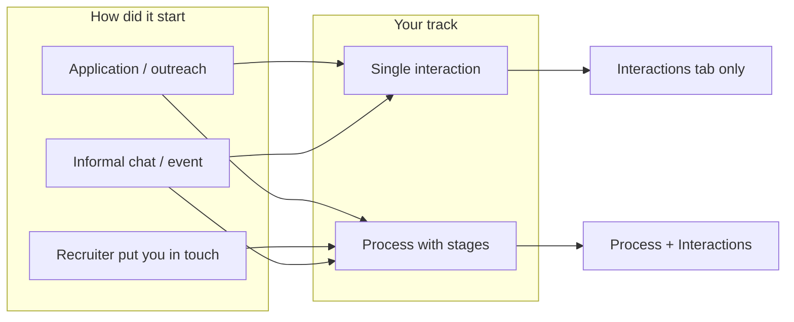
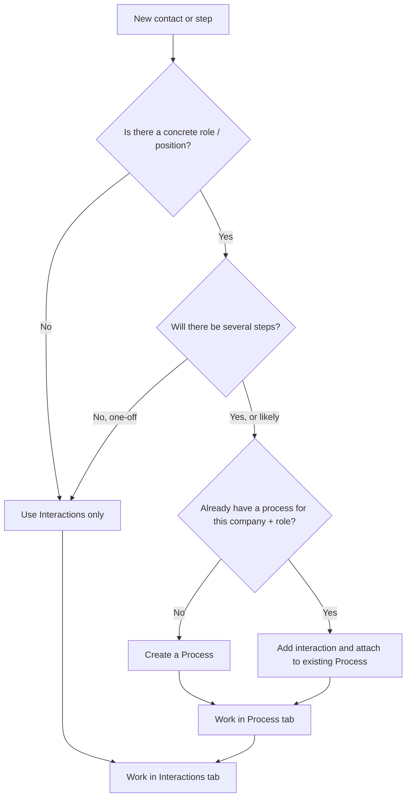
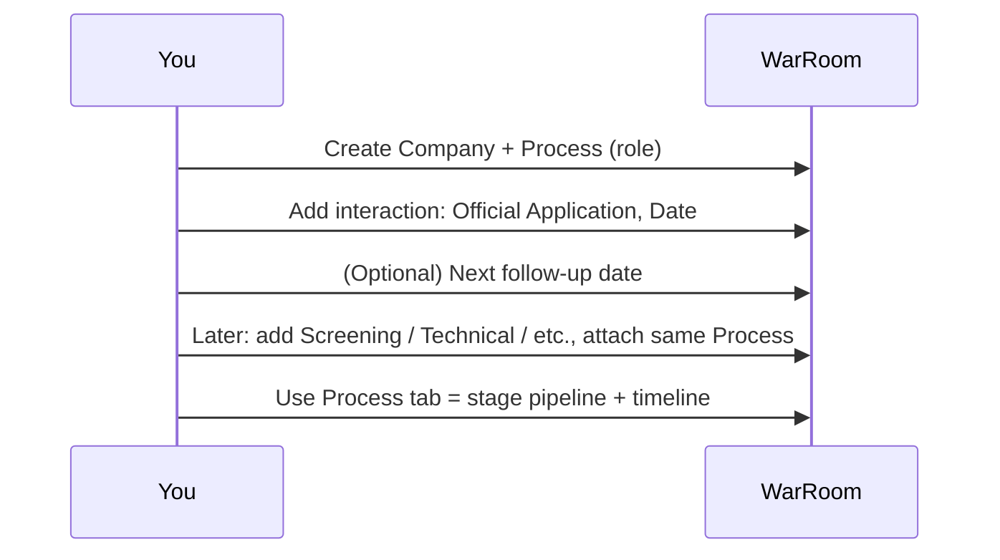
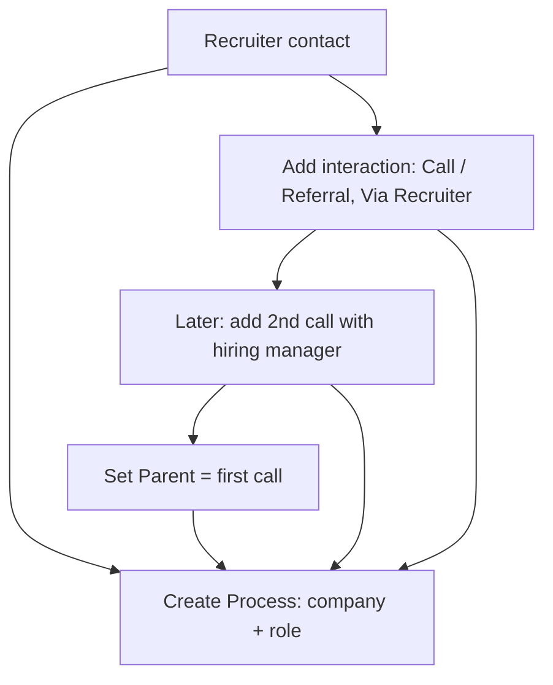
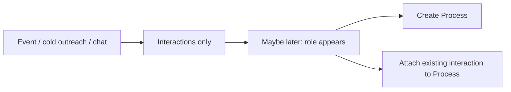

# WarRoom: User journey map & how to use the tool

This guide helps you choose the right workflow depending on your situation: one-off contact, full recruitment process, recruiter-led pipeline, or multiple roles at the same company.

**One-page visual map:** see [warroom-journey-map.png](warroom-journey-map.png) in this folder for a printable brainstorming-style overview of the four main journey types.

---

## 1. High-level map: what path am I on?

**Takeaway:**  
- **Single interaction:** e.g. one cold email, one call with no role yet → use **Interactions** only; no need to create a Process.  
- **Process:** you have (or expect) a structured pipeline for one role at one company → create a **Process** and attach interactions to it. Use **Process** tab for stage pipeline and timeline, and **Interactions** for a global view.

---

## 2. Decision map: when to create a Process vs when to stay in Interactions only

| Situation | What to do |
|-----------|------------|
| Sent one cold email, no role yet | **Interactions only.** Create interaction (type e.g. Cold Email), set Date, optional Follow-up date. No process. |
| Applied to a job (one role, one company) | **Create a Process** (company + role title). Then add an interaction (e.g. Official Application) and attach it to that process. |
| Recruiter introduced you to 2 people at the same firm | **One Process** (company + role). Add one interaction per contact/call; attach all to that process. Use "Follow-up to" for the second call linked to the first. |
| Same company, two different roles | **Two Processes** (e.g. "Company X — Role A", "Company X — Role B"). Attach each interaction to the right process. |
| Just had a call, no role yet | **Interactions only.** Type = Call, set Date. When a role appears, create a Process and attach this interaction (or a follow-up) to it. |

---

## 3. Fils conducteurs (throughlines): the main journey types

### 3.1 Direct application (you applied)

**Steps:**  
1. Create **Company** if needed.  
2. Create **Process** (company, role title, location).  
3. Add first **Interaction**: type e.g. Official Application, set **Date**, link to the process.  
4. As you progress: add new interactions (Screening, Phone Interview, Technical, etc.), attach to same process, set **Stage** on each.  
5. Use **Process** page: Pipeline = stages; (after your update) Timeline = chronological.  
6. Use **Interactions** for a global list and follow-ups; click follow-up → opens Process when linked.

---

### 3.2 Via recruiter (headhunter puts you in touch)

**Steps:**  
1. Create **Company** (the employer).  
2. Create **Process** (company + role the recruiter is working on).  
3. Add **Interaction**: type Call (or Referral), source **Via Recruiter**, pick the recruiter company; set Date; attach to process.  
4. When you have a second call (e.g. with hiring manager): create new interaction, set **Follow-up to** = the first call (so it shows as child), attach to same process.  
5. In **Interactions** (grouped by process) you’ll see the hierarchy: first call → indented second call. Same in **Process** tab.

---

### 3.3 Exploratory / no role yet

**Steps:**  
1. Only **Interactions**: add type (e.g. Call, Cold Email), Date, comment. No process.  
2. When a role crystallises: create **Process**, then edit the interaction (or add a new one) and **attach to process**.

---

### 3.4 Multiple contacts, one role (e.g. HR + hiring manager)

Same process; multiple interactions (one per contact or per meaningful step). Use **Stage** to reflect where you are (Screening, Technical, etc.). Use **Follow-up to** when one interaction clearly stems from another (e.g. “Call with HR” → “Call with hiring manager”). That gives you one process with a clear stage pipeline and a timeline, and in Interactions you see the same hierarchy.

---

## 4. What to use when: quick reference

### 4.1 Where to work

| Goal | Where |
|------|--------|
| See everything chronologically across companies | **Interactions** (list or grouped by process). |
| See one role’s pipeline by stage (Application → Technical → Offer) | **Process** tab → that process → Pipeline. |
| See one role’s timeline by date | **Process** tab → that process → Timeline (when available). |
| See overdue / upcoming follow-ups | **Dashboard** or **Interactions**. Click follow-up → opens **Process** if the interaction is linked. |
| Log a one-off (no role) | **Interactions** only; no process. |

### 4.2 Key fields

| Field | Use it when |
|-------|-------------|
| **Date** | When the thing happened (sent, call, interview). |
| **Next follow-up date** | You decided to follow up on a specific day; dashboard/list will show “Soon” or “Overdue”. |
| **Process** | This step belongs to a specific role at a company; you get Pipeline + Timeline on the process page. |
| **Follow-up to** | This interaction is a direct follow-up to another (e.g. second call after first); shows hierarchy and indent. |
| **Stage** | Where this step sits in the funnel (Screening, Technical, Final Round, etc.); drives the Process pipeline. |
| **Status** | Sent, Waiting, Follow-up, Interview, Offer, Rejected, Closed — high-level state. |
| **Type** | Official Application, LinkedIn Message, Cold Email, Call, Referral (and later: Physical Meeting). |

### 4.3 Status in practice

| Situation | Status (and type) |
|-----------|-------------------|
| Just applied | Sent |
| Waiting for reply | Waiting |
| You’re following up | Follow-up |
| Had a call / discussion, no next step yet | Waiting or (when available) Discussion |
| Formal interview step | Interview |
| Offer received | Offer |
| Rejected or closed | Rejected / Closed |

---

## 5. Visual summary: journey types at a glance

```mermaid
flowchart TB
  subgraph oneOff [One-off / exploratory]
    O1[One interaction]
    O2[Interactions tab]
    O1 --> O2
  end

  subgraph oneRole [One role, one company]
    P1[One Process]
    P2[Several interactions attached]
    P3[Stages + Timeline]
    P1 --> P2 --> P3
  end

  subgraph recruiter [Via recruiter]
    R1[Process + Via Recruiter]
    R2[First call → child calls with Follow-up to]
    R3[Same hierarchy in Process and Interactions]
    R1 --> R2 --> R3
  end

  subgraph multiRole [Same company, several roles]
    M1[One Process per role]
    M2[Interactions attached to correct Process]
    M1 --> M2
  end
```

---

## 6. Tutorial checklist: “I want to…”

- **… log that I applied today.**  
  Create or pick Company → Create or pick Process (role) → Add interaction, type Official Application, set Date, attach to process.

- **… remember to follow up in a week.**  
  On that interaction, set **Next follow-up date**. It will appear on Dashboard and in Interactions as Soon/Overdue; click → open Process if linked.

- **… see everything I have with Company X.**  
  Companies → Company X: you see contacts and linked interactions/processes. Or filter Interactions by company/process.

- **… see my pipeline for “Analyst at Bank Y”.**  
  Processes → open “Bank Y — Analyst” → Pipeline (by stage) and Timeline (by date).

- **… record that a headhunter set up two calls.**  
  One Process (Bank + role). First interaction: Call, Via Recruiter, Date. Second interaction: Call, Follow-up to = first call, Date; attach both to process. Hierarchy appears in Process and in Interactions (grouped).

- **… stop tracking a role.**  
  Process → set status Rejected or Closed. You can still add interactions (e.g. “Final rejection call”) and attach to that process.

Use this guide as your map: choose the path that matches your situation (one-off vs process, direct vs recruiter, one vs several roles), then follow the corresponding fil conducteur above.
